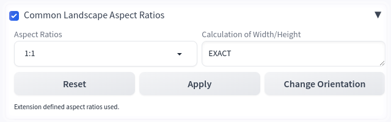

# sd-webui-aspect_ratios-dd Version 0.0.0.6 
#### Extension for the AUTOMATIC1111 Web UI

sd-webui-aspect_ratios-dd is an <i>Extension</i> for the <a href="https://github.com/AUTOMATIC1111/stable-diffusion-webui">AUTOMATIC1111</a>, which is adding the new functionality to the AUTOMATIC1111 web UI for the selection of predefined or user defined aspect ratios.<i>aspect ratios</i>.

---

## Preface

After writing my first <i>Extension</i> the realisation of this <i>Extension</i> was a little bit more complicated. 
I had a steep learning curve while programming using <i>gradio</i>. At the end of the day everything works as expected.

This will be the last version I have programmed for the time being. It fulfils its purpose and can be adapted to personal requirements. Maintenance and bug fixing are not affected by this statement.

## Motivation

The <i>Aspect Ratio</i> plays a crucial role when dealing with images. This statement is correct in relation to the painters of the Middle Ages, pictures by photographers and in AI image creation as well.

   

While using AUTOMATIC1111 I missed a tool selecting the common <i>Aspect Ratios</i>. The tools I found did not fulfil my needs. This Extension is the attempt to provide a quick access to suitable <i>Aspect Ratios</i>

## Explanation

The tool should be as simple as possible and at the same time provide all the necessary information. A drop-down menu allows you to select a predefined <i>aspect ratio</i> from a large number of <i>aspect ratios</i>. Using the button <code>Apply</code>, the Width and Height are calculated from the given <i>aspect ratio</i> and taken over in the main UI. A <code>Reset</code> button is resetting the <i>Aspect Ratio</i> back to 1:1 and Width and Height back to 512. The orientation can be switched by the button Change Orientation. An additional information is available if the calculation of the new resolution is exact or if one value is a rounded number. The resolution can be checked in the terminal window.

# Calculation of Width and Height

Depending on the orientation Width or Height is set to 512 pixel.

<pre>
   Width = 512 pixel
   Height = Width * Aspect Ratio
</pre>

<pre>
   Height = 512 pixel
   Width = Height * Aspect Ratio
</pre>

The first value is all the time set to 512. The second and calculated value is an integer or an floating point number. Both values are printed into the terminal window and can be checked there.

# What the Extension Does

After installation, you will find a panel in the AUTOMATIC1111 web UI that looks like the following image when opened.

## Implemented Aspect Ratios

The given <i>Aspect Ratios</i> are basically sorted into two blocks. First come the <i>Aspect Ratios</i> with integer numbers and then the <i>Aspect Ratios</i> with floating point numbers.

* 1:1
* 1.5:1
* 2:1
* 3:1
* 3:2
* 4:1
* 4:3
* 5:1
* 5:3
* 5:4
* 6:1
* 6:5
* 7:1
* 7:4
* 7:5
* 7:5.5
* 8:3
* 8:5
* 9:7
* 10:1
* 10:7
* 11:5
* 11.85:3
* 12:1
* 12:5
* 12:9
* 12:10
* 13:6
* 13:18
* 13:19
* 14:9
* 14:11
* 15:8
* 15:9
* 15:10
* 16:9
* 16:10
* 17:9
* 18:5
* 18:9
* 18.5:9
* 18:10
* 19:9
* 19.5:9
* 20:9
* 21:9
* 21.5:9
* 22:9
* 22:17
* 24:9
* 25:16
* 28:13
* 32:9
* 32:25
* 35:26
* 36:10
* 37:18
* 37:20
* 40:21
* 43:18
* 45:35
* 47:20
* 51:20
* 55:23
* 64:27
* 69:25
* 70:27
* 79:20
* 128:75
* 192:145
* 239:100
* 256:135
* 300:157
* 540:283
* 1.19:1
* 1.20:1
* 1.25:1
* 1.27:1
* 1.30:1
* 1.33:1
* 1.37:1
* 1.375:1
* 1.38:1
* 1.40:1
* 1.41:1
* 1.4142:1
* 1.43:1
* 1.54:1
* 1.55:1
* 1.59:1
* 1.60:1
* 1.618:1
* 1.66:1
* 1.75:1
* 1.77:1
* 1.78:1
* 1.85:1
* 1.875:1
* 1.896:1
* 1.90:1
* 1.91:1
* 2.125:1
* 2.16:1
* 2.165:1
* 2.20:1
* 2.208:1
* 2.21:1
* 2.35:1
* 2.37:1
* 2.38:1
* 2.39:1
* 2.40:1
* 2.44:1
* 2.55:1
* 2.59:1
* 2.66:1
* 2.75:1
* 2.76:1
* 3.2:1
* 3.55:1
* 3.58:1
* 3.60:1
* 3.95:1

# User Data

<code>
   ├── stable-diffusion-webui
    └── extensions
        └── sd-webui-aspect_ratios-dd
            ├── extension_data
            ├── images
            ├── json
            ├── scripts
            │   └── __pycache__
            └── user_data
<code>

# Support Request 

If there are <i>aspect ratios</i> in the <i>Extension</i> that I do not yet consider, but which were or are common, please let me know about them, that I can take them into account and that I can add them to the predefined list.
  

# To-Do

Improvement of this documentation.
    

# Known Problems

No known problems yet.

# Development and Test Environment

The <i>Extension</i> was devolped and tested on a machine with a Debian based Linux distribution istalled using the web UI AUTOMATIC111 with following specification:

* API: v1.10.0
* Python: 3.10.14
* torch: 2.1.2+cu121
* xformers: 0.0.23.post1
* gradio: 3.41.2

# References

[1] https://github.com/AUTOMATIC1111/stable-diffusion-webui

[2] https://github.com/AUTOMATIC1111/stable-diffusion-webui-extensions
